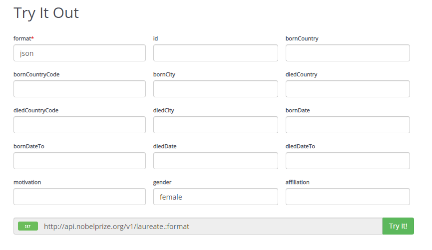
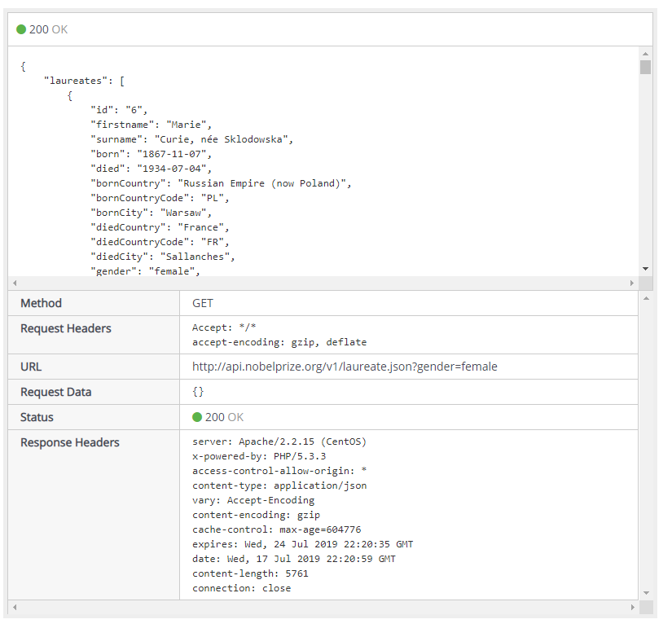

# JavaScript 3 - Week 1

## Overview

We will be building a Single Page Application that uses the [Nobel Prize API](https://nobelprize.readme.io/docs/getting-started).

New concepts covered during this lecture:

- Creating a **Single Page Application** (SPA) (vs. a multi-page application)
- Calling a server-side web API with [XMLHttpRequest](https://github.com/HackYourFuture/fundamentals/blob/master/fundamentals/XMLHttpRequest.md).
- Using asynchronous callbacks in conjunction with **XMLHttpRequest**.
- Applying the **DRY** principle ([Don't Repeat Yourself](https://en.wikipedia.org/wiki/Don%27t_repeat_yourself)) by creating functions that replace repetitive code.
- Reducing the complexity of larger code blocks by extracting small code fragments into separate, appropriately named functions.

## What is an API?

> Google "[what is an api](https://www.google.nl/search?q=what+is+an+api&oq=what+is+an+api&aqs=chrome..69i57j69i60l3.2774j0j7&sourceid=chrome&ie=UTF-8)":
>
> **API**
>
> _noun_ `computing`
>
> a set of functions and procedures allowing the creation of applications that access the features or data of an operating system, application, or other service.

We will specifically be dealing with **server-side web APIs**:

> _A server-side web API is a programmatic interface consisting of one or more publicly exposed endpoints to a defined request–response message system, typically expressed in JSON or XML, which is exposed via the web—most commonly by means of an HTTP-based web server._
>
> Source: [Wikipedia - Web API](https://en.wikipedia.org/wiki/Web_API)

Watch this YouTube video [3.24 mins]: [What is an API?](https://www.youtube.com/watch?v=s7wmiS2mSXY)

## The Nobel Prize API

In this lecture we will be using the Nobel Prize API:

> https://nobelprize.readme.io/docs/getting-started

This API provides data that _"contains information about who has been awarded the Nobel Prize, when, in what prize category and the motivation, as well as basic information about the Nobel Laureates such as birth data and the affiliation at the time of the award."_

You can try out the API by clicking the link provided above. For instance, to get data about all the female Nobel Prize laureates, press the `GET Laureate` button, scroll down on the resulting page and enter `json` in the **format** field and `female` in the **gender** field, as shown in the figure below. Then press the green **Try it!** button.

The JSON response will be as shown below.

Note the URL field: we will be using similar URLs in the code examples to fetch JSON data from the Nobel Prize API.

## Code examples

<!-- prettier-ignore -->
| Folder       | Description |
| ------------ | ----------- |
| 1‑base       | A bare bones example using XMLHttpPRequest. |
| 2‑function   | Extracts reusable code into a function that takes a URL and a callback parameter. |
| 3‑json       | Sets the response type from default (text) to json. |
| 4‑errors     | Add error handling using a node-style callback. |
| 5‑render-pre | Render API data as JSON to the page using a `<pre>` tag. |
| 6‑render-ul  | Use DOM manipulation to create a `<ul>` element and populate it with `<li>` elements using laureate data obtained from the Nobel Prize API. |
| 7‑dry        | Apply the DRY principle by creating the `createAndAppend()`function to reduce repetitive code. |
| 8‑dryer      | Enhance `createAndAppend()` to take an optional text parameter. |
| 9‑select     | Get country info from the API and render in a `<select>` element. |
| 10‑select-dryer | Finalize createAndAppend functionality. |
| 11-combine   | Combine `<select>` element with laureates data. |
| 12‑final     | Render laureate details and add CSS styling. |
