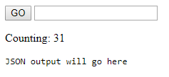
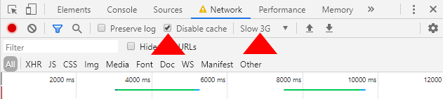
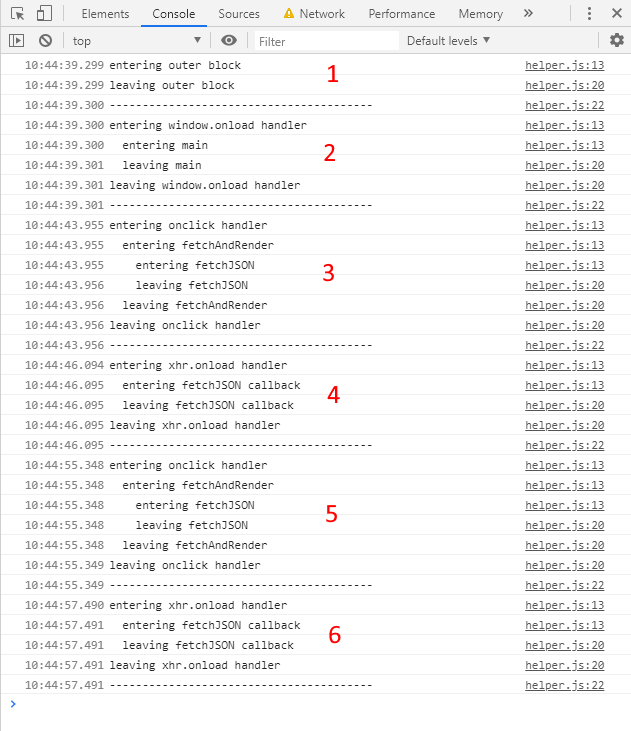
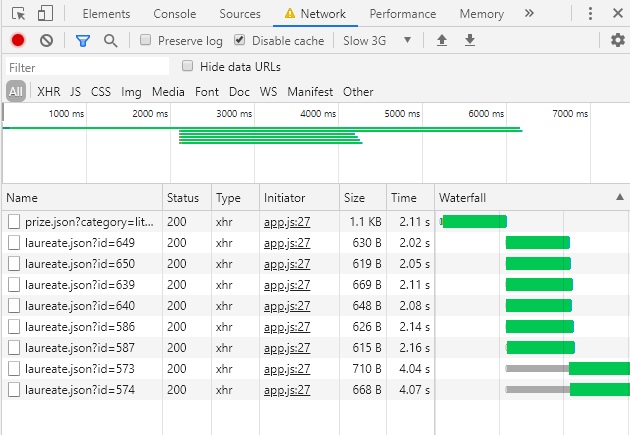
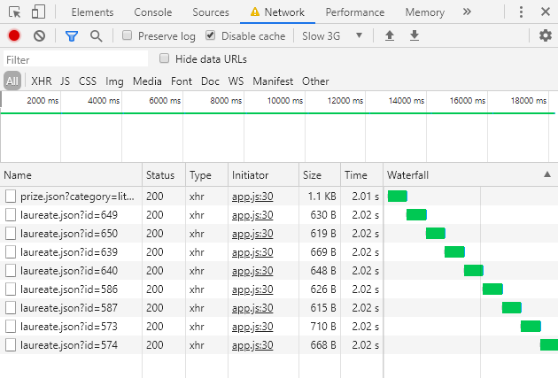

# JavaScript 3 - Week 2

## Introduction

All examples in this repo use the same user interface:

Figure 1. Base User Interface

It contains the following elements:

- A **GO** button that you can press to initiate an XMLHttpRequest to the [Nobel Prize API](https://nobelprize.readme.io/).
- A text input field. It is not used by the JavaScript code but when typing anything in it the text field will not updated while a synchronous XMLHttpRequest is pending.
- An output text field containing an incrementing counter.
- A`<pre>` tag in the `<body>` where the JSON response of the XMLHttpRequest will be displayed.

When running the examples in the Chrome browser it is for demonstration purposes best to set the **Disable cache** option and set **Throttling** to **Slow 3G** in the network tab of the Chrome Developer Tools, as indicated by the red triangles in Figure 2 below.

Figure 2. Network settings for demonstration purposes.

## Code Examples

### 1-baseline

This example represents the common base code across all examples. It consists of an HTML page amd a JavaScript file. The HTML page contains a button, an input text field and a counter. In the JavaScript file, a listener is added to the button for the `click` event. The input field is not used in the JavaScript code.

When the example is loaded, the counter is increment every 200ms. When the button is clicked, the click handler fires and simply logs `button pressed` in the console.

### 2-async

This example fetches JSON data for all female Nobel Prize laureates, using an asynchronous XMLHttpRequest. Note that while the request is pending the counter continues incrementing and the text input accepts text input.

### 3-sync

This example demonstrates the detrimental effect on the responsiveness of the browser when a **synchronous** XMLHttpRequest is used. While the network request is pending:

1. The counter momentarily stops counting.
2. The button remains rendered in the pressed state.
3. The input field appears unresponsive.

When the network response is received:

1. The counter resumes counting where it left off.
2. The button rendering returns to the unpressed state.
3. The rendering of the input text field catches up with any characters typed while the network request was pending.

Note the following warning in the Chrome console when using a **synchronous** XLMHttpRequest:

> [Deprecation] Synchronous XMLHttpRequest on the main thread is deprecated because of its detrimental effects to the end user's experience. For more help, check https://xhr.spec.whatwg.org/.

### 4-event-loop

This example is identical to **2-async**, with the exception that console.log statements are added at the beginning and end of every function (named functions or anonymous callbacks/event handlers). Figure 3 shows the console output when loading the application and subsequently pressing the **GO** button, and, after a brief pause, pressing it again.

Figure 3. Multiple (6) runs of the JavaScript event loop

#### Discussion

Each run of the JavaScript event loop is triggered by an event and ends when all associated code has _run to completion_ (i.e. when there is nothing left on the _call stack_).

1. This first run of the JavaScript event loop starts when the browser encounter the script tag in the HTML file and loads the corresponding JavaScript file.
2. When the web page is fully loaded, the `window.onload` event is fired and the event loop calls the corresponding event handler. The event handler calls function `main()`.
3. When the button is clicked, the event loop calls the `onclick` event handler, which then calls `fetchAndRender()`, which in its turn calls `fetchJSON()`. The `fetchJSON()` function fires off an `XMHHttpRequest` to fetch data from the Nobel Prize API.
4. About 2000ms later (on a simulated slow 3G network), the response from the API comes back and the event loop calls the `xhr.onload` event handler. This event handler calls the `fetchJSON` callback function, which takes the response data and renders it to the page.
5. After a while the **GO** button is pressed again and the same sequence as described in step 3 unfolds.
6. See step 4.

### 5-promise-state

Demonstrates the three internal states of a promise:

1. pending
2. settled and resolved
3. settled and rejected

### 6-promise-then

Demonstrates the **then/catch** chain and the resolved result or rejection error.

### 7-promise

This example is identical to **2-async**, but now the callback is replaced with an ES6 promise.

### 8-promise-all

This example demonstrates the use of **Promise.all()**.

First a network request is made to return data for all Nobel prizes that were awarded in the category 'literature' between the year 2000 and 2019. Then a series of network requests are made using **Promise.all()** to retrieve details for each of the laureates.

Note that the Chrome browser can handle 6 concurrent networks request at a time, which is reflected in **Waterfall** column in Figure 4.

Figure 4. Network response from **Promise.all()**.

### 9-serialized

This example is included only to show what happens if the network requests are done in serialized fashion (one after the other). The actual code used to achieve the serialization is beyond the scope of this lecture.

Figure 5. Network response from serialized promises.
