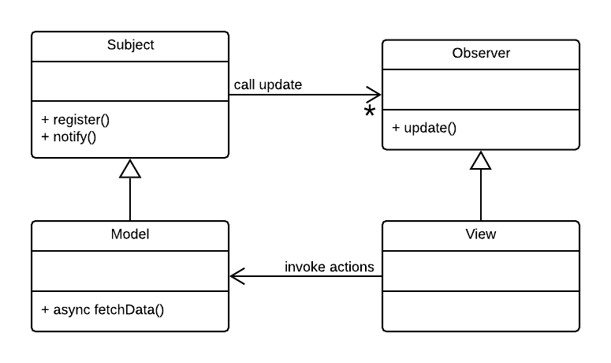

# Object Oriented Programming Examples

## OOP Introduction

Watch Brad Traversy's [JavaScript OOP Crash Course (ES5 & ES6)](https://www.youtube.com/watch?v=vDJpGenyHaA&t=1055s) on YouTube (40 mins). The example files that Brad uses can be found in this repo, folder **week3/7-oop/traversy_oop_crash_course**. To run the code:

1. Open **index.html** by right-clicking the file in the VSCode Explorer and select **Open with Live Server**.
2. Open the Chrome Developer Tools console. 
3. Select the file to run from the select box.

## 1. Nobel Prize API

This example builds on the Nobel Prize API example of week 1. Its purpose is to demonstrate the application of Object Oriented Programming, using older-style prototype-based JavaScript objects and the newer ES6 classes.

This design is loosely based on the classic [Model-View-Controller](https://en.wikipedia.org/wiki/Model%E2%80%93view%E2%80%93controller) (MVC) pattern, however, without a separate Controller component.

| Component | Description |
| --------- | ----------- |
| **Model** | The Model is responsible for fetching data on request of a View and notifies the attached Views when the data is updated. |
| **View**  | The View subscribes to updates from the Model and renders the updates to its medium, e.g. a Web page.  |

 A key benefit of this organization is the [Separation of Concerns](https://en.wikipedia.org/wiki/Separation_of_concerns):

- The Model is concerned with fetching data and notifying attached Views when data is updated. It is not concerned with rendering the data.
- The View is concerned with rendering the data and responding to DOM events. It not concerned with fetching the data.
- The Controller provides an isolation layer between the View and the Model.

Figure 1. A UML Class Diagram for the MVC Pattern as implemented here. 
(Created with **LucidChart**: [YouTube tutorial](https://youtu.be/UI6lqHOVHic) 10 mins.)

### Application Files

In this application, we have provided a main View (called **PageView** below) and two auxiliary, passive Views (**ConsoleView** and **SpeechSynthesizer**) to illustrate that a single Model can update multiple Views, rendering the Model data in different ways.

| Filename | Description |
| -------- | ----------- |
| index.html | The application's single HTML page. |
| style.css | Contains the CSS styling. |
| App.js | A JavaScript class that implements to the top-level component of the application. |
| Model.js | A JavaScript class hat implements the Model functionality. It inherits from (`extends`) the Observer class. |
| PageView.js | A JavaScript class that implements the View functionality, rendering the Model data as HTML elements in the web page. |
| ConsoleView.js |  A JavaScript class that implements a (passive) View. It simply logs the Model data to the browser console. |
| SpeechView.js | A JavaScript class that implements a (passive) View, rendering a summary of the Model data as spoken text. |
| Subject.js | A JavaScript class that implements the Subject component of the [Observer pattern](https://en.wikipedia.org/wiki/Observer_pattern). |
| Observer.js | A JavaScript class that implements the Observer component of the Observer pattern. |

### Example Folders

Two logically equivalent versions of this application are provided:

| Folder | Description |
| ------ | ----------- |
| nobel-prize-prototype | Uses pre-ES6 prototypal inheritance. |
| nobel-prize-classes | Uses ES6 classes. |

#### Prototypal inheritance 

Read: [A guide to prototype-based class inheritance in JavaScript](https://www.freecodecamp.org/news/a-guide-to-prototype-based-class-inheritance-in-javascript-84953db26df0/)