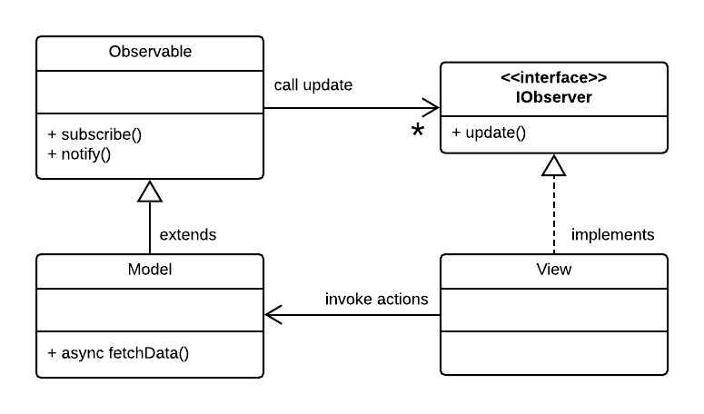

# Object Oriented Programming Examples

## OOP Introduction

Watch Brad Traversy's [JavaScript OOP Crash Course (ES5 & ES6)](https://www.youtube.com/watch?v=vDJpGenyHaA&t=1055s) on YouTube (40 mins). The example files that Brad uses can be found in this repo, folder **week3/7-oop/traversy_oop_crash_course**. To run the code:

1. Open **index-all.html** by right-clicking the file in the VSCode Explorer and select **Open with Live Server**.
2. Open the Chrome Developer Tools console. 
3. Select the file to run from the select box.

To examine a particular example in the Chrome Developer Tools, modify **index.html** to load the desired JavaScript file and open **index.html** in the browser.

## 1. Nobel Prize API

This example builds on the Nobel Prize API example of week 1. Its purpose is to demonstrate the application of Object Oriented Programming, using older-style prototype-based JavaScript objects and the newer ES6 classes.

The application is now divided into three component types:

| Component | Description |
| --------- | ----------- |
| **App**   | The top-level, 'main' component that represents the whole application. |
| **Model** | A Model component that is responsible for fetching data on request of the View component and that notifies the Views when the data is available. |
| **View**  | The View component listens for updates from the Model component and renders the updates to its medium, e.g. a Web page. |

>Note that, using this architecture, there can be multiple Views listening to updates from the Model, as we will demo in this example.

 A key benefit of this organization is the [Separation of Concerns](https://en.wikipedia.org/wiki/Separation_of_concerns):

- The Model is concerned with fetching data and notifying attached Views when data is updated. It is not concerned with rendering the data.
- The View is concerned with rendering the data as provided by the Model and with responding to DOM events. It not concerned with fetching the data.

Because this pattern of a _source_ component (our Model) needing notifying _client_ component(s) (our View) about updates is so common, this base functionality often implemented in a reusable class, usually called **Subject** or **Observable**. We can use **class inheritance** to let the Model inherit the Observable functionality. The View class must implement the interface expected by hhe Observable, in this example it must implement an `update()` method. This is illustrated in Figure 1 below. 



Figure 1. A UML Class Diagram illustrating the 'Observer' pattern.<br>
(Created with **LucidChart**: [YouTube tutorial](https://youtu.be/UI6lqHOVHic) 10 mins.)

In this diagram, a solid line with closed arrowhead signifies an _inheritance_ relationship, a dashed line with closed arrowhead signifies an _'interface'_ whereas a solid line with an open arrowhead represents a _reference_. For example, the Model class inherits from the Observable class and the View class implements the IObserver interface. In OOP parlance, the Observable class is said to be the **superclass** of the Model class, and the Model class is a **subclass** of the Observable class. Contrary to most other OOP languages, there no construct in JavaScript to describe an interface in code. It is just used as a documentation vehicle.

```js
class Model extends Observable {
  ...
}

class View {
  ...
  // Implement the update method
  update() {
    //...
  }
}
```

### Application Files

In this application, we have provided a main View (called **PageView** below) and two auxiliary, passive Views (**ConsoleView** and **SpeechSynthesizer**) to illustrate that a single Model can update multiple Views, rendering the Model data in different ways.

| Filename | Description |
| -------- | ----------- |
| index.html | The application's single HTML page. |
| style.css | Contains the CSS styling. |
| App.js | A JavaScript class that implements to the top-level component of the application. |
| Model.js | A JavaScript class that implements the Model functionality. |
| PageView.js | A JavaScript class that implements the View functionality, rendering the Model data as HTML elements in the web page. |
| ConsoleView.js |  A JavaScript class that implements a (passive) View. It simply logs the Model data to the browser console. |
| SpeechView.js | A JavaScript class that implements a (passive) View, rendering a summary of the Model data as spoken text. |
| Observable.js | A JavaScript class that implements the Observable component of the [Observer pattern](https://en.wikipedia.org/wiki/Observer_pattern). |

### Example Folders

Two logically equivalent versions of this application are provided:

| Folder | Description |
| ------ | ----------- |
| nobel-prize-prototype | Uses pre-ES6 prototypal inheritance. |
| nobel-prize-classes | Uses ES6 classes. |


#### Prototypal inheritance 

Read: [A guide to prototype-based class inheritance in JavaScript](https://www.freecodecamp.org/news/a-guide-to-prototype-based-class-inheritance-in-javascript-84953db26df0/)