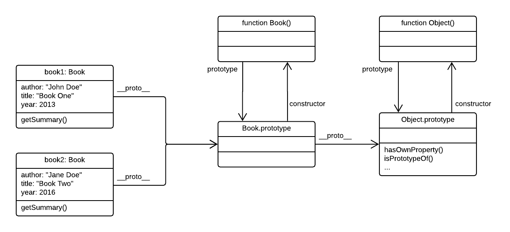
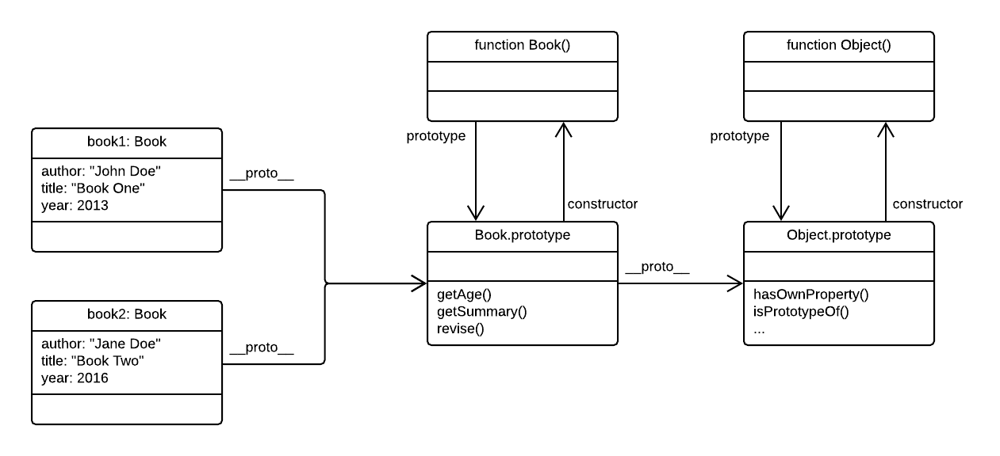
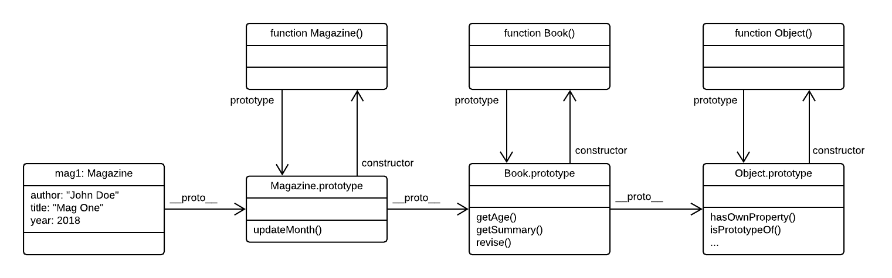
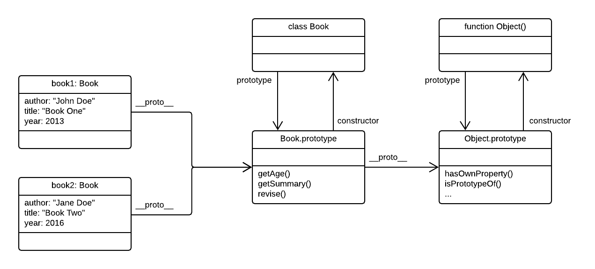
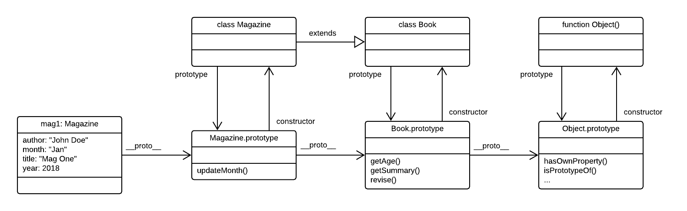

# OOP Crash Course

This README is a companion to Brad Traversy's YouTube [JavaScript OOP Crash Course (ES5 & ES6)](https://www.youtube.com/watch?v=vDJpGenyHaA&t=1055s).

> The names of the sections below correspond to the equally named JavaScript example files.

## 2_constructors

Prior to ES6, prototypal inheritance required the use of **constructor** functions. These are regular JavaScript functions that are intended to be used in combination with the `new` keyword. By convention, constructor function names start with an upper case letter (CamelCase).

When a function is called with `new`, its `this` value will be set to an empty object. By default, this empty object is linked through its _prototype chain_ to [`Object.prototype`](https://developer.mozilla.org/en-US/docs/Web/JavaScript/Reference/Global_Objects/Object#Object_instances_and_Object_prototype_object) (which in itself is an object). That is why methods such as `.hasOwnProperty()` and `.toString()` can be called on _any_ object: they are defined on `Object.prototype`. This is illustrated in Figure 1 below which corresponds to the following code snippet:

```js
function Book(title, author, year) {
  this.title = title;
  this.author = author;
  this.year = year;
  this.getSummary = function() {
    //...
  };
}

const book1 = new Book('Book One', 'John Doe', 2013);
const book2 = new Book('Book Two', 'Jane Doe', 2016);
```

In this example, each **Book** object gets, in addition to its data properties, its own copy of the `.getSummary()` method. This is wasteful in both memory space and execution time. Instead, shared function should be assigned to the prototype of the constructor function, as will be shown in the next section.



Figure 1. Prototypal linkage and the prototype chain.

Note that all object instances created with the same constructor function share a single copy of the function's prototype object:

```js
book1.__proto__ === Book.prototype // true
book2.__proto__ === Book.prototype // true
```

Output from `console.log(book1)`:

```
Book {title: "Book One", author: "John Doe", year: 2013, getSummary: ƒ}
  author: "John Doe"
  getSummary: ƒ ()
  title: "Book One"
  year: 2013
  __proto__:
    constructor: ƒ Book(title, author, year)
    __proto__:
      constructor: ƒ Object()
      hasOwnProperty: ƒ hasOwnProperty()
      isPrototypeOf: ƒ isPrototypeOf()
      ...
```

## 3_prototypes

Functions assigned to the prototype of the constructor function are shared across all object instances created with that same constructor function, as shown in Figure 2.

```js
function Book(title, author, year) {
  this.author = author;
  this.title = title;
  this.year = year;
}

Book.prototype.getSummary = function() {
  //...
};

Book.prototype.getAge = function() {
  //...
};

Book.prototype.revise = function(newYear) {
  //...
};

const book1 = new Book('Book One', 'John Doe', 2013);
const book2 = new Book('Book Two', 'Jane Doe', 2016);
```


Figure 2. Methods defined in the prototype of the constructor function are shared by all object instances.

When calling a method (using dot notation) on an object, JavaScript first will look on the object itself for the method. If not found, it will inspect the prototype of the object (using its `__proto__` property). If still not found it will go to the next prototype in the chain, until it reaches the end of the chain, which is the `Object.prototype`.

For instance, the method `.getSummary()` is not found on the `book1` object. Following the prototype chain, JavaScript finds it on `Book.prototype`. In another example, `.toString()` is not found found on the `book1` object, nor on its `Book.prototype`. It is however found on `Object.prototype`.

However, the `.turnPage()` methods is not defined on the object itself, nor anywhere on its prototype chain. Consequently, JavaScript will throw a run time error:

```js
book1.turnPage(); // Uncaught TypeError: book1.turnPage is not a function
```

Output from `console.log(book1)`:

```
Book {title: "Book One", author: "John Doe", year: 2013}
  author: "John Doe"
  title: "Book One"
  year: 2013
  __proto__:
    getAge: ƒ ()
    getSummary: ƒ ()
    revise: ƒ (newYear)
    constructor: ƒ Book(title, author, year)
    __proto__:
      constructor: ƒ Object()
      hasOwnProperty: ƒ hasOwnProperty()
      isPrototypeOf: ƒ isPrototypeOf()
      ...
```

## 4_inheritance

An object can inherit behaviour from another object through prototypal linkage. In this example, **Magazine** objects become  extended versions of **Book** objects.

```js
function Book(title, author, year) {
  this.title = title;
  this.author = author;
  this.year = year;
}

Book.prototype.getSummary = function() {
  //...
};

Book.prototype.getAge = function() {
  //...
};

function Magazine(title, author, year, month) {
  Book.call(this, title, author, year);
  this.month = month;
}

Magazine.prototype = Object.create(Book.prototype);
Magazine.prototype.constructor = Magazine;

Magazine.prototype.updateMonth = function(month) {
  //...
};

const mag1 = new Magazine('Mag One', 'John Doe', 2018, 'Jan');
```


Firstly, remember that when a function is called with `new`, the `this` value is initialized with an empty object (prototype linked to `Object.prototype`). In order to initialize the base object (in this example **Book**), its constructor function must be called, with the `this` value set to that of the calling constructor (here, **Magazine**). This is done with the `Function.prototype.call()` method, passing the `this` value of the calling constructor as its first argument. If the called constructor expects arguments they are passed as additional arguments following the `this` value. In this example, the called constructor for **Book** expects the arguments `title`, `author` and `year`.

```js
function Magazine(title, author, year, month) {
  Book.call(this, title, author, year);
  //...
}
```

Next, the prototype of the calling constructor must be linked to the called constructor. This is done with the help of [`Object.create`](https://developer.mozilla.org/en-US/docs/Web/JavaScript/Reference/Global_Objects/Object/create).

```js
Magazine.prototype = Object.create(Book.prototype);
```

Finally, we must update the `.constructor` property of the prototype to point to the correct constructor function.

```js
Magazine.prototype.constructor = Magazine;
```

With this, the prototypal linkage is completed, as shown in Figure 3 below.


Figure 3. Prototype chain from explicit prototypal inheritance.

Output from `console.log(mag1)`:

```
Magazine {title: "Mag One", author: "Jon Doe", year: 2018, month: "Jan"}
  author: "John Doe"
  month: "Jan"
  title: "Mag One"
  year: 2018
  __proto__: Book
    constructor: ƒ Magazine(title, author, year, month)
    updateMonth: ƒ (month)
    __proto__:
      getAge: ƒ ()
      getSummary: ƒ ()
      constructor: ƒ Book(title, author, year)
      __proto__:
        constructor: ƒ Object()
        hasOwnProperty: ƒ hasOwnProperty()
        isPrototypeOf: ƒ isPrototypeOf()
        ...
```

## 6_classes.js

The pre-ES6 method of using explicit prototypal linkage is rather cumbersome. Fortunately ES6 classes make this far more simple as shown in the code snippets below. The ES6 class syntax still uses prototypal linkage behind the scenes, but uses a more elegant syntax familiar from other object-oriented languages such as Java, C++ and C#.

Because it still uses prototypal linkage, the more palatable class syntax in ES6 JavaScript is sometimes classified as _syntactic sugar_.

```js
class Book {
  constructor(title, author, year) {
    this.title = title;
    this.author = author;
    this.year = year;
  }

  getSummary() {
    //...
  }

  getAge() {
    //...
  }

  revise(newYear) {
    //...
  }
}

const book1 = new Book('Book One', 'John Doe', 2013);
const book2 = new Book('Book Two', 'Jane Doe', 2016);
```

Similar to the non-ES6 case, all object instances created from the same class share a single copy of its underlying prototype object:

```js
book1.__proto__ === Book.prototype // true
book2.__proto__ === Book.prototype // true
```


Figure 4. ES6 classes: identical to Figure 1, except that the Book constructor is now a `class`.

Output from `console.log(book1)`:

```
Book {title: "Book One", author: "John Doe", year: 2013}
  author: "John Doe"
  title: "Book One"
  year: 2013
  __proto__:
    constructor: class Book
    getAge: ƒ getAge()
    getSummary: ƒ getSummary()
    revise: ƒ revise(newYear)
    __proto__:
      constructor: ƒ Object()
      hasOwnProperty: ƒ hasOwnProperty()
      isPrototypeOf: ƒ isPrototypeOf()
      ...
```


## 7_subclasses

Inheriting from a base class is easy using ES6 syntax. A class can inherit from another class by means of the `extends` keyword. This automatically sets up the required prototypal linkage, as shown in Figure 5.

```js
class Book {
  constructor(title, author, year) {
    this.title = title;
    this.author = author;
    this.year = year;
  }

  getSummary() {
    //...
  }
}

class Magazine extends Book {
  constructor(title, author, year, month) {
    super(title, author, year);
    this.month = month;
  }

  updateMonth(month) {
   //...
  }
}

const mag1 = new Magazine('Mag One', 'John Doe', 2018, 'Jan');
```


Figure 5. ES6 class-based inheritance: `extends`.

Output from `console.log(mag1)`:

```
Magazine {title: "Mag One", author: "Jon Doe", year: 2018, month: "Jan"}
  author: "Jon Doe"
  month: "Jan"
  title: "Mag One"
  year: 2018
  __proto__: Book
    constructor: class Magazine
    updateMonth: ƒ updateMonth(month)
    __proto__:
      constructor: class Book
      getSummary: ƒ getSummary()
      __proto__:
        constructor: ƒ Object()
        hasOwnProperty: ƒ hasOwnProperty()
        isPrototypeOf: ƒ isPrototypeOf()
        ...
```
